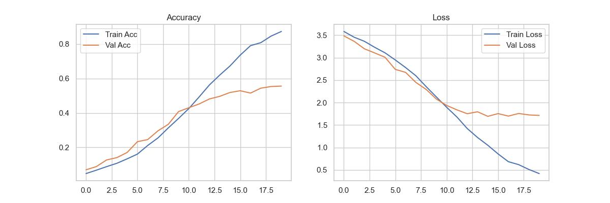

Data:\
Image count: 7349\
37 classes\
Dataset is balanced: 200 +/- 10 images per class

Base augmentations/standarization:
- resize to 224x224
- add black padding to make all images square
- normalization:
```python     
A.Normalize(mean=(0.485, 0.456, 0.406),
std=(0.229, 0.224, 0.225)),
 ```

## Experiment 1

- No augmentations, only standarizations
- model CNN1
- lr = 0.0001

```python
class CNN1(nn.Module):
    def __init__(self):
        super(CNN1, self).__init__()

        self.features = nn.Sequential(
            nn.Conv2d(3, 16, kernel_size=3, padding=1),
            nn.ReLU(),
            nn.MaxPool2d(kernel_size=2, stride=2, padding=1),

            nn.Conv2d(16, 32, kernel_size=3, padding=1),
            nn.ReLU(),
            nn.MaxPool2d(kernel_size=2, stride=2, padding=1),

            nn.Conv2d(32, 64, kernel_size=3, padding=1),
            nn.ReLU(),
            nn.MaxPool2d(kernel_size=2, stride=2, padding=1),

            nn.Conv2d(64, 128, kernel_size=3, padding=1),
            nn.ReLU(),
            nn.MaxPool2d(kernel_size=2, stride=2, padding=1),
        )


        self.classifier = nn.Sequential(
            nn.Flatten(),
            nn.Linear(28800, 64),
            nn.ReLU(),
            nn.Dropout(0.3),
            nn.Linear(64, 37),
        )

    def forward(self, x):
        x = self.features(x)
        x = self.classifier(x)
        return x
```

=== Metrics ===\
accuracy: 0.1605\
precision_macro: 0.1515\
recall_macro: 0.1613\
f1_macro: 0.1469\
f1_weighted: 0.1463\
balanced_accuracy: 0.1613


### Conclusions:
- Early stopping seems to work well
- learning rate seems to be okay, overfitting is pretty quick but lower learning rate is not acceptable

## Experiment 2
- No augmentations, only standarizations
- model CNN2
- lr = 0.0001
```python
class CNN2(nn.Module):
    def __init__(self):
        super(CNN2, self).__init__()

        self.features = nn.Sequential(
            nn.Conv2d(3, 32, kernel_size=3, padding=1),
            nn.ReLU(),
            nn.BatchNorm2d(32),
            nn.MaxPool2d(kernel_size=2, stride=2, padding=1),

            nn.Conv2d(32, 64, kernel_size=3, padding=1),
            nn.ReLU(),
            nn.BatchNorm2d(64),
            nn.MaxPool2d(kernel_size=2, stride=2, padding=1),

            nn.Conv2d(64, 128, kernel_size=3, padding=1),
            nn.ReLU(),
            nn.BatchNorm2d(128),
            nn.MaxPool2d(kernel_size=2, stride=2, padding=1),

            nn.Conv2d(128, 256, kernel_size=3, padding=1),
            nn.ReLU(),
            nn.BatchNorm2d(256),
            nn.MaxPool2d(kernel_size=2, stride=2, padding=1),
        )


        self.classifier = nn.Sequential(
            nn.Flatten(),
            nn.Linear(57600, 64),
            nn.ReLU(),
            nn.Dropout(0.3),
            nn.Linear(64, 37),
        )

    def forward(self, x):
        x = self.features(x)
        x = self.classifier(x)
        return x
```

=== Metrics ===\
accuracy: 0.2490\
precision_macro: 0.2564\
recall_macro: 0.2499\
f1_macro: 0.2444\
f1_weighted: 0.2436\
balanced_accuracy: 0.2499


### conclusions:
- results are much better than the previous net
- overfitting was observed earlier, thats normal becouse bigger network learns quicker, time to introduce augmentations 


### Augmentations used in latter experiments:
```python
train_transforms = A.Compose([
    A.LongestMaxSize(max_size=224),
    A.PadIfNeeded(min_height=224, min_width=224, border_mode=0, fill=(0, 0, 0)),
    A.HorizontalFlip(p=0.5),
    A.ShiftScaleRotate(
        shift_limit=0.05,
        scale_limit=0.1,
        rotate_limit=15,
        p=0.5
    ),
    A.RandomBrightnessContrast(p=0.3),
    A.HueSaturationValue(p=0.3),
    A.OneOf([
        A.GaussianBlur(),
        A.GaussNoise()
    ], p=0.2),
    A.Normalize(mean=(0.485, 0.456, 0.406),
                std=(0.229, 0.224, 0.225)),
    ToTensorV2()
])
```
## Experiment 3
- with augmentations
- model CNN2
- lr = 0.0001

model: CNN2

Experiment was stopped because learning rate was way to small, example on epoch 13:\
Epoch 13\
Train Loss: 3.5322, Train Acc: 0.0519\
Val Loss: 3.4972, Val Acc: 0.0619

### conclusions:
- learning rate needs to be much higher with augmentations that were used

## Experiment 4
- with augmentations
- model CNN2
- lr = 0.001

lowering learning rate didn't do anything, augmenations are probably too strong 


### Augmentations used in latter experiments:
```python
train_transforms = A.Compose([
    A.LongestMaxSize(224),
    A.PadIfNeeded(min_height=224, min_width=224, border_mode=0, fill=(0, 0, 0)),
    A.HorizontalFlip(p=0.5),
    A.RandomBrightnessContrast(p=0.2),
    A.ShiftScaleRotate(
        shift_limit=0.03,
        scale_limit=0.05,
        rotate_limit=10,
        p=0.3
    ),
    A.Normalize(
        mean=(0.485, 0.456, 0.406),
        std=(0.229, 0.224, 0.225)
    ),
    ToTensorV2()
])
```

## Experiment 5
- with augmentations
- model CNN2
- lr = 0.0001


=== Metrics ===\
accuracy: 0.4048\
precision_macro: 0.4215\
recall_macro: 0.4053\
f1_macro: 0.4078\
f1_weighted: 0.4071\
balanced_accuracy: 0.4053


### conclusions:
- overfitting reduced dramatically
- results are much better, augmentations are good


## Experiment 6
- with augmentations
- model CNN3
- lr = 0.0001

```python
class CNN3(nn.Module):
    def __init__(self):
        super(CNN3, self).__init__()

        self.features = nn.Sequential(
            nn.Conv2d(3, 32, kernel_size=3, padding=1),
            nn.ReLU(),
            nn.BatchNorm2d(32),
            nn.MaxPool2d(kernel_size=2, stride=2, padding=1),

            nn.Conv2d(32, 64, kernel_size=3, padding=1),
            nn.ReLU(),
            nn.BatchNorm2d(64),
            nn.MaxPool2d(kernel_size=2, stride=2, padding=1),

            nn.Conv2d(64, 128, kernel_size=3, padding=1),
            nn.ReLU(),
            nn.BatchNorm2d(128),
            nn.MaxPool2d(kernel_size=2, stride=2, padding=1),

            nn.Conv2d(128, 256, kernel_size=3, padding=1),
            nn.ReLU(),
            nn.BatchNorm2d(256),
            nn.MaxPool2d(kernel_size=2, stride=2, padding=1),

            nn.Conv2d(256, 512, kernel_size=3, padding=1),
            nn.ReLU(),
            nn.BatchNorm2d(512),
            nn.MaxPool2d(kernel_size=2, stride=2, padding=1),
        )


        self.classifier = nn.Sequential(
            nn.Flatten(),
            nn.Linear(57600, 128),
            nn.ReLU(),
            nn.Dropout(0.3),
            nn.Linear(128, 64),
            nn.ReLU(),
            nn.Linear(64, 37),
        )

    def forward(self, x):
        x = self.features(x)
        x = self.classifier(x)
        return x
```

=== Metrics ===\
accuracy: 0.5259\
precision_macro: 0.5314\
recall_macro: 0.5265\
f1_macro: 0.5199\
f1_weighted: 0.5197\
balanced_accuracy: 0.5265


### conclusions:
- results improved significantly
- network learned faster

## Experiment 7
- with augmentations
- model CNN4
- lr = 0.0001

```python

class CNN4(nn.Module):
    def __init__(self):
        super(CNN4, self).__init__()

        self.features = nn.Sequential(
            nn.Conv2d(3, 32, kernel_size=3, padding=1),
            nn.ReLU(),
            nn.BatchNorm2d(32),
            nn.MaxPool2d(kernel_size=2, stride=2, padding=1),

            nn.Conv2d(32, 64, kernel_size=3, padding=1),
            nn.ReLU(),
            nn.BatchNorm2d(64),
            nn.MaxPool2d(kernel_size=2, stride=2, padding=1),

            nn.Conv2d(64, 128, kernel_size=3, padding=1),
            nn.ReLU(),
            nn.BatchNorm2d(128),
            nn.MaxPool2d(kernel_size=2, stride=2, padding=1),

            nn.Conv2d(128, 256, kernel_size=3, padding=1),
            nn.ReLU(),
            nn.BatchNorm2d(256),
            nn.MaxPool2d(kernel_size=2, stride=2, padding=1),

            nn.Conv2d(256, 512, kernel_size=3, padding=1),
            nn.ReLU(),
            nn.BatchNorm2d(512),
            nn.MaxPool2d(kernel_size=2, stride=2, padding=1),

            nn.Conv2d(512, 1024, kernel_size=3, padding=1),
            nn.ReLU(),
            nn.BatchNorm2d(1024),
            nn.MaxPool2d(kernel_size=2, stride=2, padding=1),
        )


        self.classifier = nn.Sequential(
            nn.Flatten(),
            nn.Linear(25600 , 128),
            nn.ReLU(),
            nn.Dropout(0.3),
            nn.Linear(128, 64),
            nn.ReLU(),
            nn.Linear(64, 37),
        )

    def forward(self, x):
        x = self.features(x)
        x = self.classifier(x)
        return x
```

=== Metrics ===\
accuracy: 0.5816\
precision_macro: 0.5979\
recall_macro: 0.5817\
f1_macro: 0.5796\
f1_weighted: 0.5795\
balanced_accuracy: 0.5817


### conclusions:
- metrics improved slightly, probably the deepest sensible architecture

## Experiment 8
- with augmentations
- model ResidualCNN
- lr = 0.0001

```python
class ResidualSE(nn.Module):
    def __init__(self, channels):
        super().__init__()
        self.conv = nn.Sequential(
            nn.Conv2d(channels, channels, 3, padding=1),
            nn.ReLU(),
            nn.BatchNorm2d(channels),
            nn.Conv2d(channels, channels, 3, padding=1),
            nn.BatchNorm2d(channels)
        )
        self.se = SEBlock(channels)

    def forward(self, x):
        out = self.conv(x)
        out = self.se(out)
        return F.relu(out + x)

class SEBlock(nn.Module):
    def __init__(self, channels, reduction=8):
        super().__init__()
        self.pool = nn.AdaptiveAvgPool2d(1)
        self.fc = nn.Sequential(
            nn.Linear(channels, channels // reduction),
            nn.ReLU(),
            nn.Linear(channels // reduction, channels),
            nn.Sigmoid()
        )

    def forward(self, x):
        b, c, _, _ = x.size()
        w = self.pool(x).view(b, c)
        w = self.fc(w).view(b, c, 1, 1)
        return x * w

class ResidualCNN(nn.Module):
    def __init__(self):
        super().__init__()

        self.block1 = nn.Sequential(
            nn.Conv2d(3, 16, 3, padding=1),
            nn.ReLU(),
            nn.BatchNorm2d(16),
            ResidualSE(16),
            nn.MaxPool2d(2, 2, padding=1)
        )

        self.block2 = nn.Sequential(
            nn.Conv2d(16, 32, 3, padding=1),
            nn.ReLU(),
            nn.BatchNorm2d(32),
            ResidualSE(32),
            nn.MaxPool2d(2, 2, padding=1)
        )

        self.block3 = nn.Sequential(
            nn.Conv2d(32, 64, 3, padding=1),
            nn.ReLU(),
            nn.BatchNorm2d(64),
            ResidualSE(64),
            nn.MaxPool2d(2, 2, padding=1)
        )

        self.block4 = nn.Sequential(
            nn.Conv2d(64, 128, 3, padding=1),
            nn.ReLU(),
            nn.BatchNorm2d(128),
            ResidualSE(128),
            nn.MaxPool2d(2, 2, padding=1),
        )

        self.classifier = nn.Sequential(
            nn.Flatten(),
            nn.Linear(28800, 256),
            nn.GELU(),
            nn.BatchNorm1d(256),
            nn.Dropout(0.4),

            nn.Linear(256, 64),
            nn.GELU(),
            nn.BatchNorm1d(64),
            nn.Dropout(0.2),

            nn.Linear(64, 37)
        )

    def forward(self, x):
        x = self.block1(x)
        x = self.block2(x)
        x = self.block3(x)
        x = self.block4(x)
        x = self.classifier(x)
        return x
```
=== Metrics ===\
accuracy: 0.3211\
precision_macro: 0.3287\
recall_macro: 0.3218\
f1_macro: 0.3176\
f1_weighted: 0.3170\
balanced_accuracy: 0.3218


### conclusions:
- Although architecture looks promising, network probably should be deeper for this task
- Early stopping was activated after a lot of epochs with overfitting, probably should tweak sensitivity of early stop


## Experiment 9
CNN5
=== Metrics ===\
accuracy: 0.5190\
precision_macro: 0.5325\
recall_macro: 0.5191\
f1_macro: 0.5181\
f1_weighted: 0.5178\
balanced_accuracy: 0.5191



### Conclusions:
- metrics were worse compared to CNN4, it means this architecture is too deep/complex for this task and augmentations

## Final Conclusions:
Best model was CNN4 with accuracy of 0.58, it is not a satisfying result but its not tragic considering\
the task was not that trivial with 37 classes to predict and architecture used was very basic.\
I successfully managed to find optimal depth of the network with experiments.\
Augmentations improved the results significantly, although i had to make them less drastic than the first approach\
for the networks to learn properly.\
Residual CNN seemed promising, further experiments would be needed, probably the core of the network was too small.\
considering that f1_macro and accuracy scores were very similar in all tests models used were predicting\
all classes with similar accuracy.